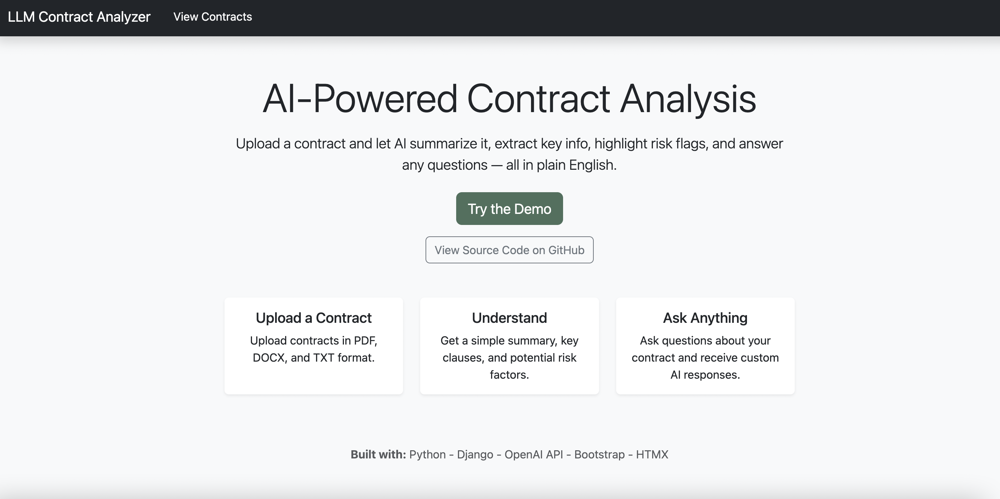
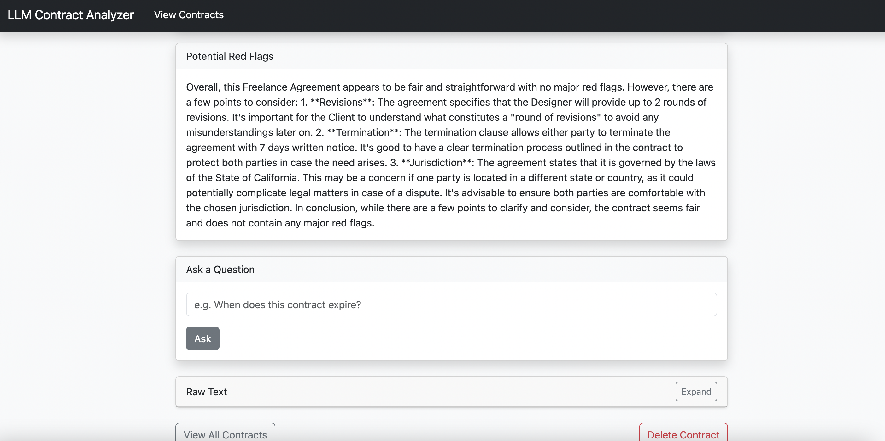

# LLM Contract Analyzer

**LLM Contract Analyzer** is an AI-powered web app to help users quickly understand legal contracts. It allows you to upload files and the app will:

- Summarize the contract in plain English
- Extract key information 
- Allow users to gain insight into potential red flags and risks 
- Let users ask live questions and get simple, clear responses 

## Live Demo 
Live demo here: https://llm-contract-analyzer.onrender.com/
You can try these sample contracts, or feel free to upload your own:
- [Sample Contract](contracts/sample_contract.pdf)
- [Sample NDA](contracts/sample_nda.pdf)
- [Freelance Contract](contracts/freelance_contract.docx)

## Features

- Upload Contracts
    - Supports PDF, DOCX and TXT files
- Summary 
    - GPT-generated, plain English summaries of contracts
- Info Extraction 
    - Lists key names, dates, monetary terms, and more
- Red Flag Detection
    - Higlights potential red flags, risky or vague language, potentially harmful clauses etc. 
- Interactive Questions
    - Allows users to ask questions and retrieve personalized insights into the contract.
- Raw Text
    - Toggles raw text to view full original text
- Landing Page 
    - Clean, polished landing page to showcase functionality 

## Tech Stack

- Backend: Python & Django
- Frontend: Boostrap 5, HTML, HTMX
- LLM: OpenAI GPT via API
- File handling: pdfplumber, python-docx
- Database: sqlite3

> You're welcome to upload your own contracts, just make sure they are in the correct format (pdf, docx, txt)

## Screenshots

## Landing Page

## Contract Page

